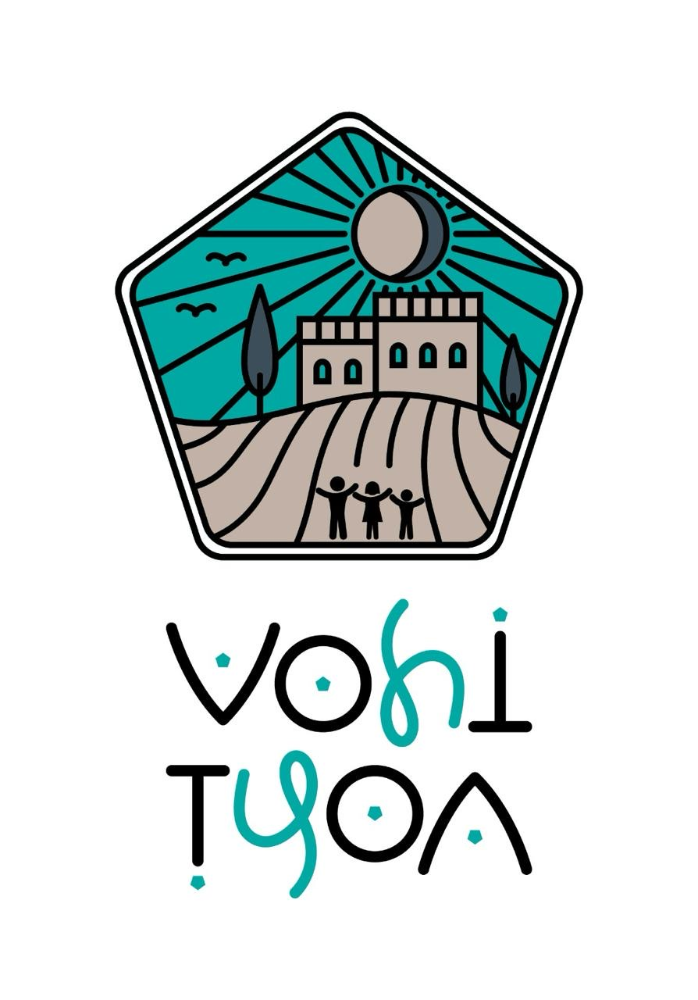

</br>


# VohiTsoa - A personalized application designed to meet an organization's needs

## Project Overview
VohiTsoa is a user-friendly mobile application designed to simplify the process of planning future reservations by having a quick glance of every reservation. The app also allows the user to manage the entreprise's worker's payroll.

## Features
- Reservation management 
- Worker payroll
- Secure user authentication
- Cross-platform support (iOS and Android)
- Real-time data synchronization
- Modern and intuitive user interface

## Technologies Used
### Frontend
- *Flutter*: Cross-platform mobile development framework

### Backend & Services
- *Firebase*: Backend as a Service (BaaS)
  - *Firestore*: Real-time database
  - *Firebase Authentication*: User authentication

### Development Tools
- Flutter SDK (^3.7.0)
- Dart SDK
- Android Studio / Xcode
- VS Code

## Getting Started

### Prerequisites
1. Flutter SDK installed on your machine
2. Firebase account
3. Android Studio or Xcode for emulation
4. Git for version control

### Installation
1. Clone the repository:
   ```bash
   git clone https://github.com/KugleBlitz007/vohi_tsoa.git
   ```

2. Install dependencies:
   ```bash
   flutter pub get
   ```
   

3. Set up Firebase:
   - Create a new Firebase project in the website
   ```bash
   fluttefire configure
   ```
   
   - Follow the instructions
   - Choose your firebase project
   - Add what platform you want to use in your project
   - Download and add the configuration files (e.g. google-services.json)
   - Enable Authentication and Firestore

4. Do not forget to add the files containing API keys in your .gitignore
   (any time you want to change computers, just re-add the firebase configuration in step 3)

5. Run the app:
   ```bash
   flutter run
   ```
   - Or Run in vs code to have hot reloading everytime you save

## Project Structure
```
assets/         # Images, icons, and other static assets
lib/
├── models/         # Data models
├── screens/        # Screen pages
├── services/       # Business logic and API services
└── main.dart       # Application entry point
```
## Future Enhancements

   📸 Worker's attendance through QR code scanning

   📤 Worker pay export (PDF/CSV)

   🔔 Push notifications for payday ro reservation reminders
   
## Contributing
1. Fork the repository
2. Create your feature branch (git checkout -b feature/AmazingFeature)
3. Commit your changes (git commit -m 'Add some AmazingFeature')
4. Push to the branch (git push origin feature/AmazingFeature)
5. Open a Pull Request


## Acknowledgments
- Flutter team for the amazing framework
- Firebase for the backend services
- All contributors and supporters of the project

## Ressources

- [Lab: Write your first Flutter app](https://docs.flutter.dev/get-started/codelab)
- [Cookbook: Useful Flutter samples](https://docs.flutter.dev/cookbook)

For help getting started with Flutter development, view the
[online documentation](https://docs.flutter.dev/), which offers tutorials,
samples, guidance on mobile development, and a full API reference.

## Helpfull tips

- whenever installing new things, kill the terminal

- run flutter pub get to get all dependencies

- Current authentication methods only use email based login and and sign up, so as long as we do not use more secure authentication like google sign in or others, we can ignore firebase's warnings about authentication

- By default, Cloud Firestore in Flutter (using the cloud_firestore package) enables offline persistence. This means:
Data you have already loaded (queried or listened to) is cached locally on the device.
If you lose connection, your app can still read and query this cached data.
Writes (add/update/delete) you make while offline are queued and sent to Firestore when the connection is restored.

- Release an android APK command : 
```bash 
flutter build apk
```
